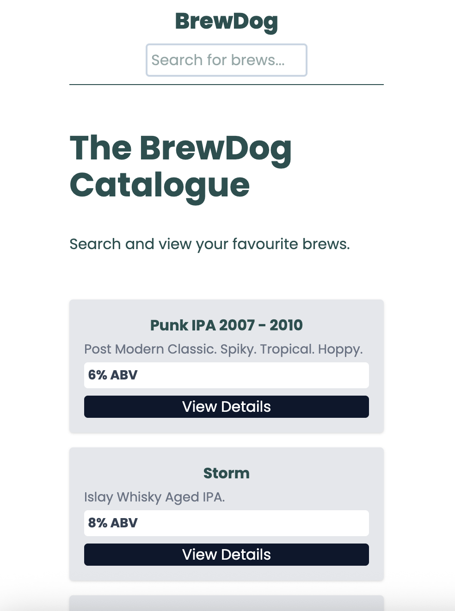
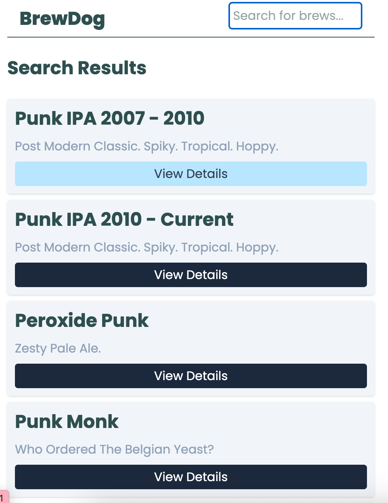

# 🌟 BrewDog Catalogue  
This is a React-based beer discovery app powered by the Punk API. It enables users to search for beers by name, explore featured selections, and view concise details for each beer. The project was built to practice API integration, client-side routing, and component-driven UI development.

## ✨ Features  
- Users can search for a beer  
- Users can view details for specific beers  
- Users can view featured products on the home page  

## 🛠️ Tech Stack  
- React  
- React Router 
- TypeScript
- TailwindCSS
- Punk Api 

## 📸 Screenshots  


### Home Page

<p align="center">
  
</p>

<br />

### Search Page

<p align="center">
  
</p>

<br />

### Details Page

<p align="center">
  
</p>

## 🧪 Tests

https://github.com/user-attachments/assets/4b90ab19-6ff4-4e13-8361-f993ed1fcc40

<br />

The testing stack includes:

Vitest or Jest for unit testing

React Testing Library for component and UI testing

Basic automated tests have been implemented for key pages: Home Page and DetailsPage

Verifies that featured beers render correctly

Ensures core UI elements load as expected

## 📚 API / Data Source
This project uses the Punk API: https://punkapi.com/

## 🗂️ Project Structure
```
src
├── api
│   ├── queries
│   └── types
├── assets
├── components
│   ├── BrewCardItem
│   ├── Header
│   └── SearchInput
└── pages
    ├── details
    ├── home
    └── search
    
```
🎯 What I Learned

Working with async data and loaders in React Router

Structuring TypeScript types to match API response

I learnt how to implement promise.all to make sure that all requests settle together

How to mock a loader from React Router in a testign environment

https://github.com/user-attachments/assets/85d5497a-9830-4aae-afda-8078e665ffef


🚀 Future Improvements

I could extract link into a resusable component

I could a filtering or sorting system for the beers based on the abv or name


