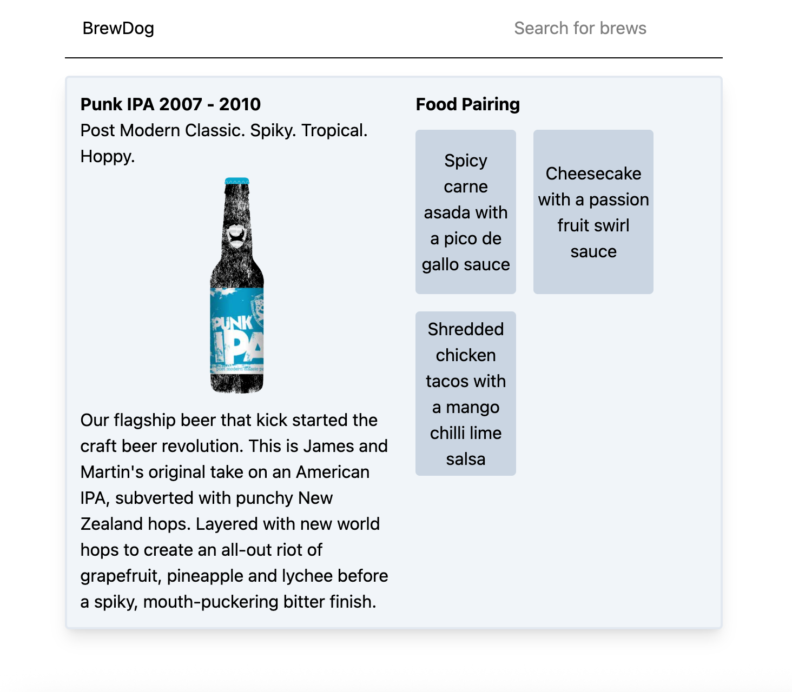

# 🌟 BrewDog Catalogue  
This is a React-based beer search app powered by the Punk API. It allows users to search beers by name and view a brief summary of each result. I built this to practice API integration, routing, and component-driven UI design.

## ✨ Features  
- Users can search for a beer  
- Users can view details for specific beers  
- Users can view featured products on the home page  

## 🛠️ Tech Stack  
- React  
- React Router 
- TypeScript
- TailwindCSS
- Punk Api 

## 📸 Screenshots  


Home Page: <br>
 alt="Alt text" width="500"><br>

Search Page: <br>
<br>

Details Page: <br>
<br>

## 🧪 Tests
No automated tests yet. These are planned for a future update.

## 📚 API / Data Source
This project uses the Punk API: https://punkapi.com/

## 🗂️ Project Structure
```
src
├── api
│   ├── queries
│   └── types
├── assets
├── components
│   ├── BrewCardItem
│   ├── Header
│   └── SearchInput
└── pages
    ├── details
    ├── home
    └── search
    
```
🎯 What I Learned

Working with async data and loaders in React Router

Structuring TypeScript types to match API response

I learnt how to implement promise.all to make sure that all requests settle together


https://github.com/user-attachments/assets/85d5497a-9830-4aae-afda-8078e665ffef


🚀 Future Improvements

I need to add some improvements to the styles

I need to make this responsive

I need to add some tests

I could a filtering or sorting system for the beers based on their abv or name


